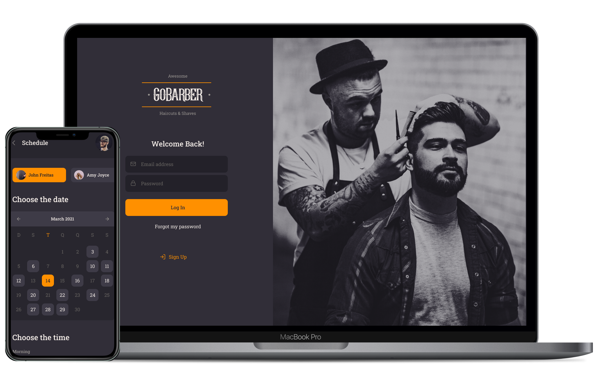

<h1 align="center">
  
</h1>

<h3 align="center">
  GoBarber project - ReactJS App 
</h3>

<p align="center">
  

  <a href="https://www.linkedin.com/in/johnfreitasau/" target="_blank" rel="noopener noreferrer">
    
  </a>

  

  <a href="https://github.com/johnfreitasau/gobarber-web/commits/master">
    
  </a>

  <a href="https://github.com/johnfreitasau/gobarber-web/issues">
    
  </a>
  <a href="https://github.com/johnfreitasau/gobarber-web/blob/master/LICENSE">
    
  </a>
</p>

<p align="center">
  <a href="#%EF%B8%8F-about-the-project">About the project</a>&nbsp;&nbsp;&nbsp;|&nbsp;&nbsp;&nbsp;
  <a href="#-technologies">Technologies</a>&nbsp;&nbsp;&nbsp;|&nbsp;&nbsp;&nbsp;
  <a href="#-getting-started">Getting started</a>&nbsp;&nbsp;&nbsp;|&nbsp;&nbsp;&nbsp;
  <a href="#-how-to-contribute">How to contribute</a>&nbsp;&nbsp;&nbsp;|&nbsp;&nbsp;&nbsp;
  <a href="#-license">License</a>
</p>

</br>


To see the **api**, click here: [GoBarber Rest API](https://github.com/johnfreitasau/gobarber-api)</br>
To see the **mobile client**, click here: [GoBarber Mobile](https://github.com/johnfreitasau/gobarber-mobile)

## 🚀 Technologies

Technologies that I used to develop this web client

- [ReactJS](https://reactjs.org/)
- [TypeScript](https://www.typescriptlang.org/)
- [React Router DOM](https://reacttraining.com/react-router/)
- [React Icons](https://react-icons.netlify.com/#/)
- [UnForm](https://unform.dev/)
- [Yup](https://github.com/jquense/yup)
- [Styled Components](https://styled-components.com/)
- [Polished](https://github.com/styled-components/polished)
- [Axios](https://github.com/axios/axios)
- [Eslint](https://eslint.org/)
- [Prettier](https://prettier.io/)
- [EditorConfig](https://editorconfig.org/)

## 💻 Getting started

### Requirements

- Have this application's [API](https://github.com/johnfreitasau/gobarber-api) running

**Clone the project and access the folder**

```bash
$ git clone https://github.com/johnfreitasau/gobarber-web.git && cd gobarber-web
```

**Follow the steps below**

```bash
# Install the dependencies
$ yarn

# Be sure the file 'src/services/api.ts' have the IP to your API

# Start the client
$ yarn start
```

## 🤔 How to contribute

**Make a fork of this repository**

```bash
# Fork using GitHub official command line or using the github website.

$ gh repo fork johnfreitasau/gobarber-web
```

**Follow the steps below**

```bash
# Clone your fork
$ git clone your-fork-url && cd gobarber-web

# Create a branch with your feature
$ git checkout -b my-feature

# Make the commit with your changes
$ git commit -m 'feat: My new feature'

# Send the code to your remote branch
$ git push origin my-feature
```

After your pull request is merged, you can delete your branch

## 📝 License

This project is licensed under the MIT License - see the [LICENSE](LICENSE) file for details.

---
